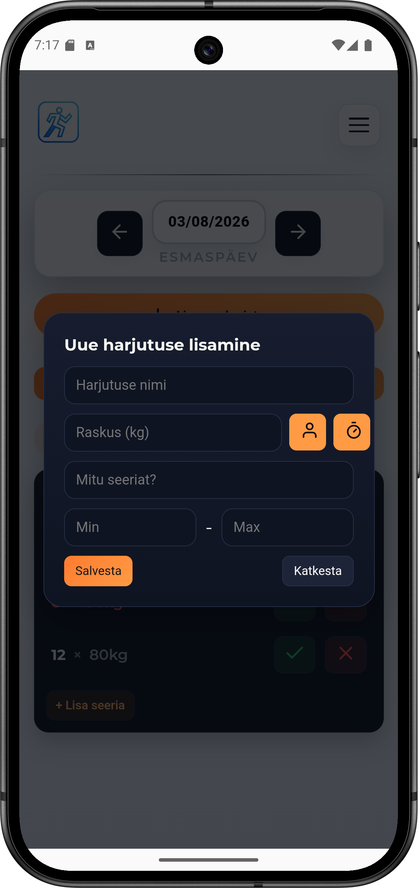
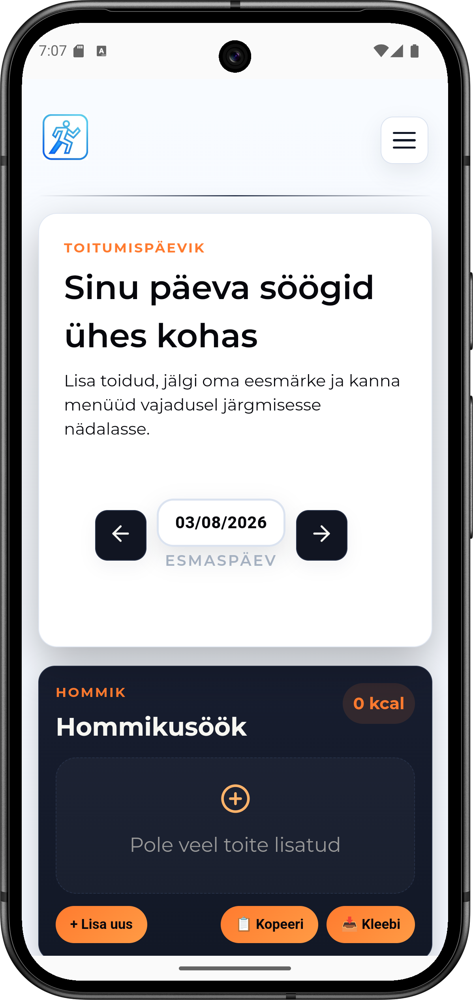

# TrackerIO

TrackerIO on Androidi treeningu- ja toitumispäeviku rakendus, mis aitab kasutajal jälgida oma treeninguid, toitumist ja arengut.

### 🏋️ Treeningute jälgimine
- Treeningute loomine ja salvestamine
- Harjutuste lisamine, muutmine ja haldamine
- Seeriate, korduste ja raskuste jälgimine
- Ajapõhiste harjutuste tugi
- Puhketimer seeriate vahel
- Treeningu timer heli ja vibratsiooniteavitustega
- Ringtreeningud
- Seeriate ja harjutuste märkimine lõpetatuks
- Harjutuste ümberjärjestamine lohistamisega
- Treeningute kopeerimine ja korduvkasutamine
- Treeningute kopeerimine järgmisesse nädalasse

### 📊 Progressi jälgimine
- Treeningute ajalugu
- Harjutuste statistika
- Progressi jälgimine
- Isiklikud rekordid

### 🍽️ Toitumine
- Toitumispäevik
- Päevase toitumise ülevaade
- Kohalik andmete salvestamine

### 🔒 Privaatsus ja andmete salvestamine
- Konto pole vajalik
- Sisselogimine pole vajalik
- Pilveandmebaasi pole
- Andmed salvestatakse lokaalselt LocalStorage'i
- Rakendus on loodud töötama ka ilma internetiühenduseta

## Tehnoloogiad

- HTML
- CSS
- JavaScript
- Capacitor
- Android Studio
- LocalStorage

## Platvorm

- Android rakendus (ehitatud Capacitoriga)

## Ekraanipildid

  
  
  

## Projekti eesmärk

Ehitatud isikliku projektina eesmärgiga luua lihtne ja kiire treeningurakendus ilma kontode, pilveteenuse ja liigse keerukuseta.

---

# English

TrackerIO is an Android workout and nutrition tracking application that helps users track workouts, nutrition and progress.

### 🏋️ Workout Tracking
- Create and save workouts
- Add, edit and manage exercises
- Track sets, reps and weight
- Support for time-based exercises
- Rest timers between sets
- Workout timers with sound and vibration notifications
- Circuit training
- Mark sets and exercises as completed
- Reorder exercises with drag & drop
- Copy and reuse workouts
- Copy workouts into the following week

### 📊 Progress Tracking
- Workout history
- Exercise statistics
- Progress tracking
- Personal records

### 🍽️ Nutrition
- Daily food diary
- Daily nutrition overview
- Local data storage

### 🔒 Privacy & Storage
- No account required
- No login
- No cloud database
- Data stored locally using LocalStorage
- Designed to work without an internet connection

## Technologies

- HTML
- CSS
- JavaScript
- Capacitor
- Android Studio
- LocalStorage

## Platform

- Android application (built with Capacitor)

## ScreenShots

  
  
  

## Project Goal

Created as a personal project to build a simple and fast workout tracking application without accounts, cloud services, or unnecessary complexity.

